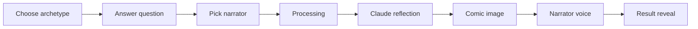

# SEEN

<p align="center">
  <strong>What would you look like if someone truly saw you?</strong><br>
  <sub>One honest answer. One witnessed moment. Not a conversation.</sub>
</p>

<p align="center">
  <a href="#why-seen">Why SEEN</a> ·
  <a href="#demo">Demo</a> ·
  <a href="#quick-start">Quick start</a> ·
  <a href="#how-it-works">How it works</a> ·
  <a href="#configuration">Configuration</a> ·
  <a href="#development">Development</a>
</p>

---

## Why SEEN

Most AI products want to keep talking. SEEN does the opposite.

You take one [PrinciplesYou](https://principlesyou.com/archetypes) archetype, answer **one** question with one honest truth, and pick how you want to be witnessed. The app returns a single reflection — in words, image, and voice — and then stops.

| What SEEN is | What SEEN is not |
|--------------|------------------|
| A mirror held up once | A chatbot that keeps replying |
| Structure beneath what you wrote | Advice or coaching |
| One line you'll remember | A summary of your answer |
| A 4-panel comic of *you* in that moment | A generic stock illustration |
| A narrator speaking *to* you | A conversation thread |

**The problem:** personality frameworks give you labels. Journals give you blank pages. Chatbots give you endless dialogue. None of them give you the feeling of being *seen* — someone naming the pattern under your words, handing it back, and letting you sit with it.

**What SEEN solves:** a single, irreversible moment of witness. You write one truth. The app reflects it back as structure, image, and voice. No follow-ups. No feed. No "tell me more."

---

## Built on PrinciplesYou

SEEN is designed to run **on top of** [PrinciplesYou](https://principlesyou.com/archetypes) — Ray Dalio's archetype framework (28 types across Leaders, Builders, and Guardians).

**Prerequisite:** take the [PrinciplesYou assessment](https://principlesyou.com/) (free) and know your archetype before using SEEN. The app does not replace that assessment; it extends it into a personal reflection experience.

This repo ships:
- All 28 archetypes with reflection questions and image direction (`archetypes.json`)
- Full archetype descriptions for richer AI prompts (`archetypes_fulldescription.json`)
- Archetype artwork fetched from PrinciplesYou social cards (`scripts/fetch_archetype_images.py`)

Archetype names, categories, and descriptions align with PrinciplesYou. If you fork SEEN for another framework, swap the JSON data — the pipeline stays the same.

---

## Demo

<div align="center">


</div>

<p align="center">
  <em>Pick an archetype → answer one honest question → choose a narrator → receive a reflection, comic page, and voice.</em>
</p>

**Download:** [demo-github.mp4](https://github.com/rwnd/seen-app/releases/download/demo-v1/demo-github.mp4) · **Run locally:** [http://localhost:8000/docs-assets/demo.mp4](http://localhost:8000/docs-assets/demo.mp4)

> GitHub README cannot inline-play `<video src="docs/assets/...">` from the repo tree. The clip above is served from a [release asset](https://github.com/rwnd/seen-app/releases/tag/demo-v1) (compressed to under 10 MB). The same file lives in `docs/assets/demo.mp4` for local serving.

---

## What you get

| Output | Description |
|--------|-------------|
| **Reflection** | 4–6 sentences in the narrator's voice — not advice, not summary, but the structure beneath what you wrote |
| **The line** | One sentence you'll remember — the emotional punchline |
| **Your page** | A 4-panel portrait comic with captions and narrator speech |
| **Voice** | The full reflection spoken by a cloned narrator ([Voicebox](http://127.0.0.1:17493)) or OpenAI TTS |

---

## Quick start

### Prerequisites

- Python 3.11+
- Your [PrinciplesYou](https://principlesyou.com/archetypes) archetype
- API keys: [Anthropic](https://console.anthropic.com/) (required), [OpenAI](https://platform.openai.com/) and/or [Google AI](https://aistudio.google.com/) (image), optional [Voicebox](http://127.0.0.1:17493) (cloned voice)

### Install

```bash
git clone https://github.com/rwnd/seen-app.git
cd seen-app

python3 -m venv .venv
source .venv/bin/activate
pip install -r requirements.txt

cp .env.example .env
# Edit .env — add at least ANTHROPIC_API_KEY
```

### Run

```bash
uvicorn main:app --reload --port 8000
```

Open **http://localhost:8000**

On first run, four bundled sample reflections are copied into `data/results/` so the gallery is not empty. Your own reflections are saved there too and stay gitignored.

### Optional: archetype images

If archetype thumbnails are missing, fetch them from PrinciplesYou:

```bash
python scripts/fetch_archetype_images.py
```

---

## How it works



1. **Input** — Searchable archetype picker, four reflection categories, narrator tone tiles.
2. **Processing** — Cinematic hold screen while Claude writes the reflection.
3. **Result curtain** — Page and voice finish behind a full-screen overlay, then reveal together.
4. **Gallery** — Past reflections filterable by archetype.

### Pipeline (background task)

| Step | Provider | Output |
|------|----------|--------|
| Text | Claude (`TEXT_MODEL_PRIMARY`) | `reflection`, `the_line`, `comic_page` JSON |
| Image | Gemini Imagen or OpenAI DALL·E | `{uuid}_comic.png` |
| Voice | Voicebox or OpenAI TTS | `{uuid}_audio.wav` / `.mp3` |

Steps save progressively — the UI polls `/api/status/{uuid}` and `/api/result/{uuid}`.

---

## Configuration

Copy `.env.example` to `.env`.

### API keys

| Variable | Required | Purpose |
|----------|----------|---------|
| `ANTHROPIC_API_KEY` | Yes | Reflection text (Claude) |
| `OPENAI_API_KEY` | For image/voice fallback | DALL·E + OpenAI TTS |
| `GEMINI_API_KEY` | For Gemini images | Imagen comic pages |
| `VOICEBOX_BASE_URL` | For cloned voice | Default `http://127.0.0.1:17493` |

### Pipeline flags

Enable features incrementally while testing:

| Variable | Default | Effect |
|----------|---------|--------|
| `SEEN_ENABLE_TEXT` | `true` | Generate reflection |
| `SEEN_ENABLE_VOICE` | `false` | Generate narrator audio |
| `SEEN_ENABLE_IMAGE` | `false` | Generate comic page |

### Providers

| Kind | Primary env | Secondary env |
|------|-------------|---------------|
| Text | `TEXT_MODEL_PRIMARY` | `TEXT_MODEL_SECONDARY` |
| Voice | `VOICE_PROVIDER_PRIMARY` | `VOICE_PROVIDER_SECONDARY` |
| Image | `IMAGE_PROVIDER_PRIMARY` | `IMAGE_PROVIDER_SECONDARY` |

**Voice providers:** `openai`, `voicebox`  
**Image providers:** `gemini`, `openai`

Example — Voicebox primary with OpenAI fallback:

```env
SEEN_ENABLE_VOICE=true
VOICE_PROVIDER_PRIMARY=voicebox
VOICE_PROVIDER_SECONDARY=openai
```

### Voicebox (cloned narrators)

Each narrator in `narrators.json` has a `voicebox_profile` (e.g. `steve_jobs`). Create matching profiles in Voicebox with 45–90s of clean reference audio.

Test a profile:

```bash
curl -s -X POST http://127.0.0.1:17493/speak \
  -H 'Content-Type: application/json' \
  -d '{"text":"Short test.","profile":"steve_jobs","language":"en"}'
```

See [docs/EDITING_DATA.md](docs/EDITING_DATA.md) for narrator fields (`voice_bridge`, `voice_signoff`, etc.).

### Logging

```bash
SEEN_LOG_LEVEL=DEBUG uvicorn main:app --reload --port 8000
tail -f data/logs/seen.log
```

When something fails, search logs for the reflection UUID from the URL (`/result/<uuid>`).

---

## Project structure

```
seen-app/
├── main.py                 # App entrypoint
├── archetypes.json         # 28 PrinciplesYou archetypes + questions
├── archetypes_fulldescription.json
├── narrators.json          # Narrator tones + voice profiles
├── seen/
│   ├── app.py              # FastAPI factory + static mounts
│   ├── routes.py           # HTTP handlers
│   ├── settings.py         # Env → Settings dataclass
│   ├── config.py           # Paths, constants, logging
│   ├── validation.py       # Form input validation
│   ├── gallery.py          # Gallery data loading
│   ├── prompts.py          # Claude + comic prompt templates
│   ├── utils.py            # JSON I/O, result storage, normalization
│   ├── gateways/           # External APIs (Claude, images, TTS)
│   └── logic/              # Pipeline orchestration
├── templates/              # Jinja2 HTML
├── static/                 # CSS, JS, archetype/narrator images
├── docs/
│   ├── assets/demo.mp4     # Demo video
│   ├── ARCHITECTURE.md     # Module map
│   └── EDITING_DATA.md     # Schema for archetypes & narrators
├── scripts/                # Image fetch, archetype generation
├── tests/                  # Pytest suite
└── data/
    ├── samples/            # Bundled demo reflections (committed)
    ├── results/            # Generated reflections (gitignored)
    └── logs/               # App logs (gitignored)
```

---

## Editing content

JSON config reloads on each request — no restart needed with `--reload`.

| File | What to edit |
|------|----------------|
| `archetypes.json` | Archetype names, questions, image direction |
| `narrators.json` | Narrator tones, Voicebox profiles, voice bridges |
| `docs/EDITING_DATA.md` | Full field reference |

Validate:

```bash
.venv/bin/python -c "from main import load_archetypes, load_narrators; load_archetypes(); load_narrators(); print('OK')"
```

---

## Development

### Tests

```bash
pip install -r requirements-dev.txt
pytest
```

Coverage highlights:
- Form validation (`seen/validation.py`)
- Comic JSON validation (`seen/prompts.py`)
- Narrator speech assembly (`seen/gateways/tts.py`)
- Result normalization + gallery loading
- HTTP smoke tests (home, processing, demo video)

### Architecture notes

See [docs/ARCHITECTURE.md](docs/ARCHITECTURE.md) for module responsibilities and request flow.

---

## API reference

| Method | Path | Description |
|--------|------|-------------|
| `GET` | `/` | Input form |
| `POST` | `/reflect` | Queue reflection (form POST) |
| `GET` | `/processing/{uuid}` | Processing page |
| `GET` | `/api/status/{uuid}` | Poll step status |
| `GET` | `/api/result/{uuid}` | Full result JSON |
| `GET` | `/result/{uuid}` | Result page |
| `GET` | `/gallery` | Past reflections |
| `POST` | `/reflect/retry/{uuid}` | Retry with saved input |

---

## License

MIT — see [LICENSE](LICENSE).

PrinciplesYou archetype names and descriptions are property of Bridgewater Associates. This project is not affiliated with or endorsed by PrinciplesYou or Bridgewater.

---

<p align="center">
  <strong>SEEN</strong> · One moment. Not a conversation. Just you, seen.
</p>
